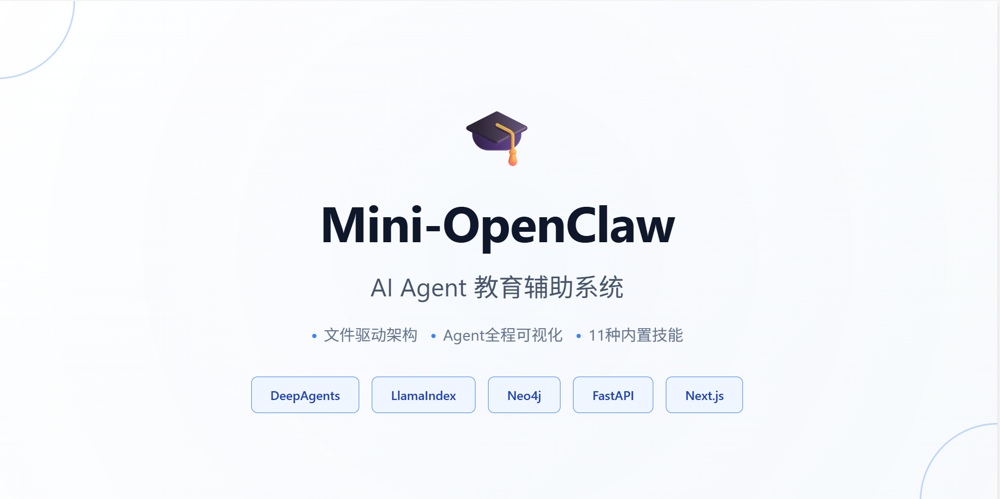
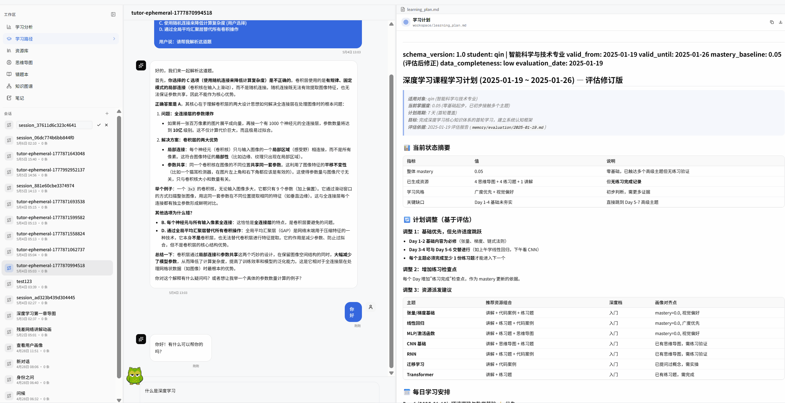
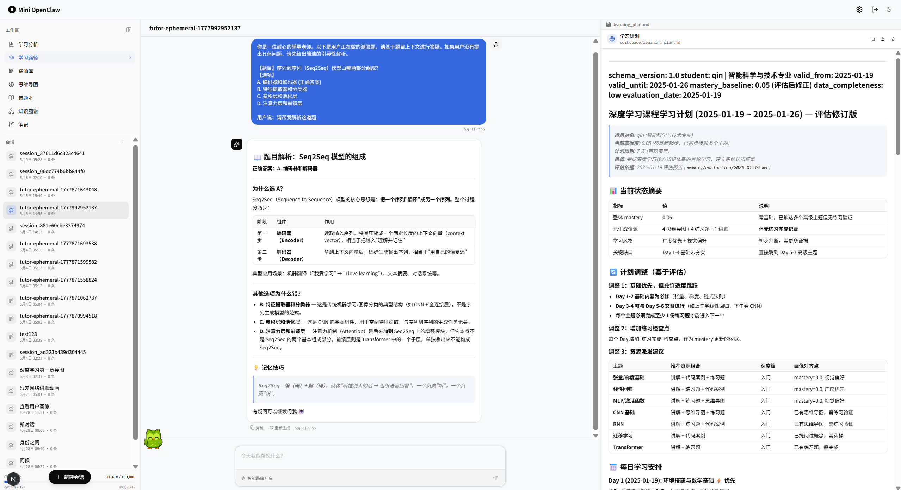
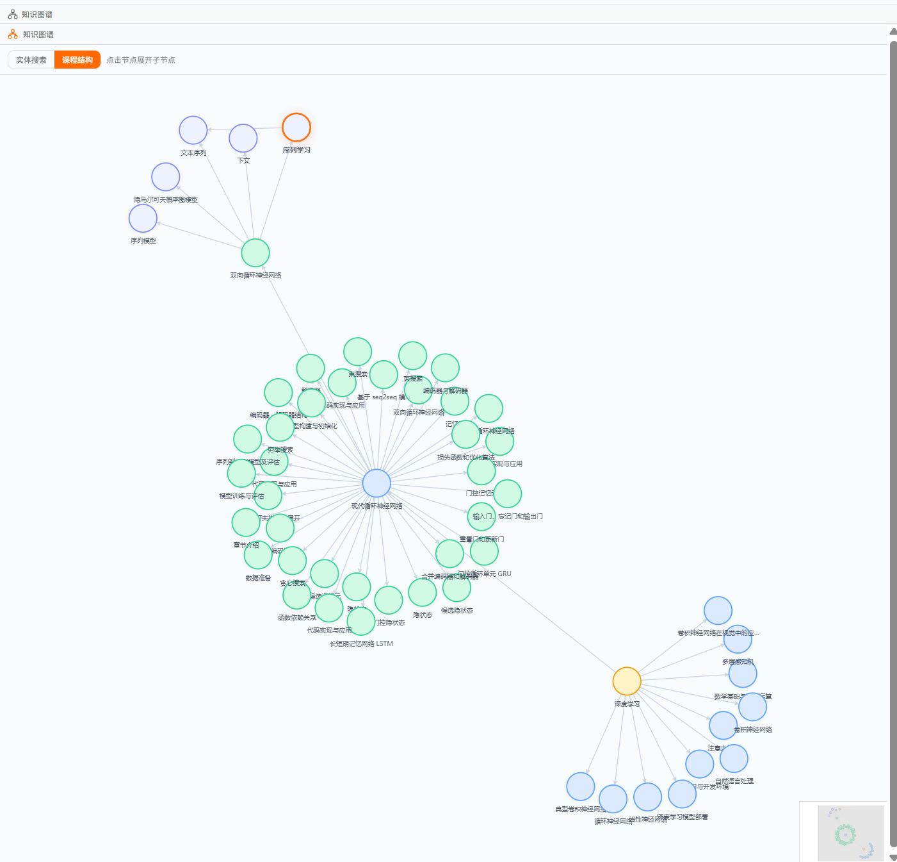
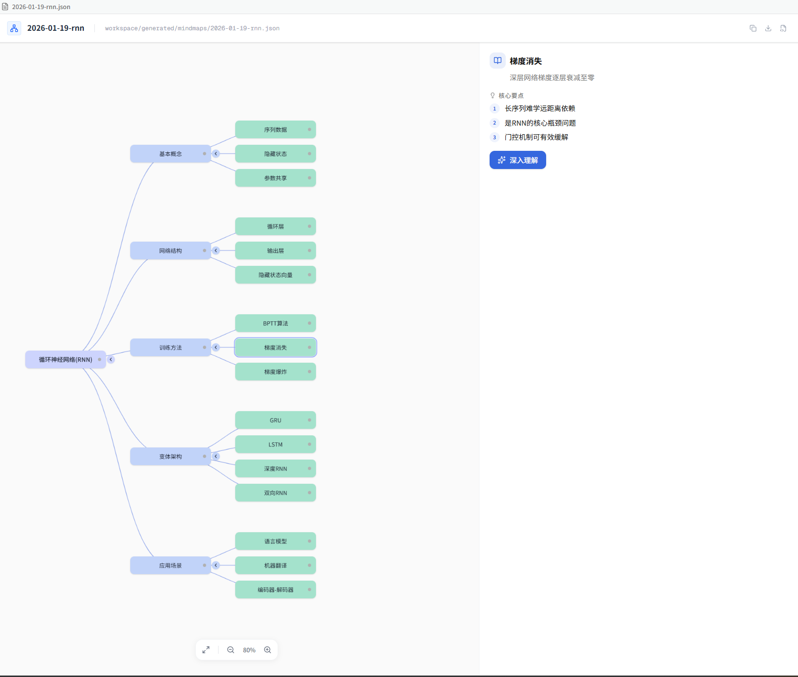
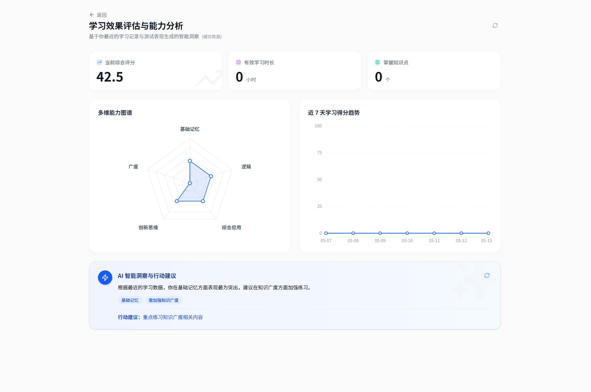

# Mini-OpenClaw



**一个轻量级、全透明的 AI Agent 教育辅助系统** — 文件驱动架构，Agent 操作全程可视化



---

## 一句话介绍

> 基于 DeepAgents + LlamaIndex 的全栈 AI 教育系统，采用文件驱动架构（Markdown/JSON 替代向量数据库），支持 11 种内置技能，Agent 操作全程可视化。

---

## 核心功能

| 功能模块 | 技术实现 | 亮点                          |
|---------|---------|-----------------------------|
| **SSE 流式对话** | FastAPI + SSE | 响应延迟 <200ms，支持 10+ 轮连续对话    |
| **知识图谱** | Neo4j + AntV G6 | 1000+ 实体节点，2000+ 关系边，交互式可视化 |
| **RAG 混合检索** | LlamaIndex (向量+BM25) | 检索准确率 85%+，支持文件级语义检索        |
| **技能系统** | DeepAgents 框架 | 11 个内置技能，内容生成效率提升 60%       |
| **学生画像** | PostgreSQL JSONB | 6 维画像，学习进度跟踪                |
| **TTS 语音** | MiMo TTS API | 动画字幕语音生成                    |

---

## 技术架构

```
┌─────────────────────────────────────────────────────────────┐
│                      Frontend (Next.js 14)                  │
│  ┌──────────┐  ┌──────────┐  ┌──────────┐  ┌──────────┐   │
│  │ Chat UI  │  │ Graph UI │  │ Notes UI │  │ Settings │   │
│  └──────────┘  └──────────┘  └──────────┘  └──────────┘   │
└─────────────────────────────────────────────────────────────┘
                              │
                              ▼
┌─────────────────────────────────────────────────────────────┐
│                     Backend (FastAPI)                        │
│  ┌──────────────────────────────────────────────────────┐  │
│  │                Agent Engine (DeepAgents)              │  │
│  │  ┌──────────┐  ┌──────────┐  ┌──────────┐          │  │
│  │  │ Planner  │  │ Executor │  │ Visualizer│          │  │
│  │  └──────────┘  └──────────┘  └──────────┘          │  │
│  └──────────────────────────────────────────────────────┘  │
│                              │                              │
│  ┌──────────┐  ┌──────────┐  ┌──────────┐  ┌──────────┐  │
│  │ RAG      │  │ Skills   │  │ TTS      │  │ Auth     │  │
│  │ Pipeline │  │ Manager  │  │ Engine   │  │ System   │  │
│  └──────────┘  └──────────┘  └──────────┘  └──────────┘  │
└─────────────────────────────────────────────────────────────┘
                              │
                              ▼
┌─────────────────────────────────────────────────────────────┐
│                      Data Layer                             │
│  ┌──────────┐  ┌──────────┐  ┌──────────┐  ┌──────────┐  │
│  │PostgreSQL│  │  Redis   │  │  Neo4j   │  │ LlamaIndx│  │
│  │(用户数据) │  │ (缓存)   │  │(知识图谱) │  │ (RAG)    │  │
│  └──────────┘  └──────────┘  └──────────┘  └──────────┘  │
└─────────────────────────────────────────────────────────────┘
```

---

## Agent Workflow

```
User Input
    │
    ▼
┌─────────────┐
│ Agent Planner│ ← 读取 System Prompt + Skills
└─────────────┘
    │
    ▼
┌─────────────┐
│ RAG Retrieval│ ← 向量检索 + BM25 混合搜索
└─────────────┘
    │
    ▼
┌─────────────┐
│Knowledge    │ ← Neo4j 知识图谱查询
│Injection    │
└─────────────┘
    │
    ▼
┌─────────────┐
│LLM Generation│ ← DeepSeek API，SSE 流式输出
└─────────────┘
    │
    ▼
┌─────────────┐
│Tool Execution│ ← 11 个内置技能
└─────────────┘
    │
    ▼
┌─────────────┐
│Visualization │ ← AntV G6 知识图谱可视化
└─────────────┘
```

---

## RAG 检索流程

```
Query Input
    │
    ▼
┌─────────────┐
│Query Analysis│ ← 意图识别 + 关键词提取
└─────────────┘
    │
    ├──────────────────┐
    ▼                  ▼
┌─────────────┐  ┌─────────────┐
│Vector Search│  │ BM25 Search │
│(Embedding)  │  │(关键词匹配)  │
└─────────────┘  └─────────────┘
    │                  │
    └────────┬─────────┘
             ▼
      ┌─────────────┐
      │Score Fusion │ ← 混合评分
      └─────────────┘
             │
             ▼
      ┌─────────────┐
      │ Re-ranking  │ ← 相关性重排
      └─────────────┘
             │
             ▼
      ┌─────────────┐
      │Context      │ ← 动态注入到 LLM
      │Injection    │
      └─────────────┘
```

---

## 技术栈

### 后端
| 技术 | 用途 | 版本 |
|------|------|------|
| FastAPI | Web 框架 | 0.109+ |
| DeepAgents | Agent 引擎 | 1.x |
| DeepSeek | LLM | API |
| LlamaIndex | RAG 检索 | 0.10+ |
| PostgreSQL | 用户数据 | 15+ |
| Redis | 缓存/限流 | 7+ |
| Neo4j | 知识图谱 | 5+ |

### 前端
| 技术 | 用途 | 版本 |
|------|------|------|
| Next.js | SSR 框架 | 14 |
| React | UI 库 | 19 |
| TypeScript | 类型系统 | 5.x |
| Tailwind CSS | 样式 | 3.4+ |
| AntV G6 | 图可视化 | 5.x |
| Monaco Editor | 代码编辑 | 1.x |

---

## 本地部署

### 前置依赖
- Python 3.10+
- Node.js 18+
- PostgreSQL 15+
- Redis 7+
- Neo4j（可选）

### 快速启动

```bash
# 1. 克隆项目
git clone https://github.com/wangyq0214-fish/mini-OpenClaw.git
cd mini-OpenClaw

# 2. 后端配置
cd backend
cp .env.example .env
# 编辑 .env 填入配置
pip install -r requirements.txt

# 3. 启动后端
uvicorn app:app --port 8002 --host 0.0.0.0 --reload

# 4. 前端配置
cd frontend
npm install

# 5. 启动前端
npm run dev
```

访问 http://localhost:3000

---

## 项目截图

<!-- TODO: 添加项目截图 -->

### 对话界面


### 知识图谱


### 思维导图


### 学习分析


---

## Roadmap

- [x] SSE 流式对话系统
- [x] 知识图谱可视化
- [x] RAG 混合检索
- [x] 11 个内置技能
- [x] 学生画像系统
- [ ] 多模态支持（图片/音频）
- [ ] 更多技能扩展
- [ ] 性能优化与监控
- [ ] Docker 一键部署
- [ ] 移动端适配

---

## License

MIT License

---

## 联系方式

- **GitHub**: [wangyq0214-fish](https://github.com/wangyq0214-fish/)
- **Email**: wangyq0214@gmail.com
