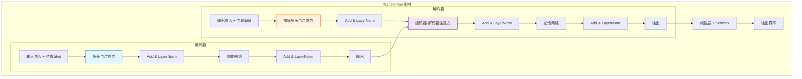

# Transformer 模型深度学习讲义

**学生信息**：qin - 智能科学与技术专业 - 大三
**课程章节**：第10章 注意力机制 - 10.5.6 Transformer 模型
**前置知识**：RNN/LSTM/GRU、注意力机制基础、编码器-解码器架构

---

## 目录

1. [引言：从RNN到Transformer的演进](#1-引言从rnn到transformer的演进)
2. [自注意力机制（Self-Attention）](#2-自注意力机制self-attention)
3. [多头注意力（Multi-Head Attention）](#3-多头注意力multi-head-attention)
4. [位置编码（Positional Encoding）](#4-位置编码positional-encoding)
5. [Transformer模型架构](#5-transformer模型架构)
6. [Transformer的优势与影响](#6-transformer的优势与影响)
7. [PyTorch代码实现](#7-pytorch代码实现)
8. [总结与展望](#8-总结与展望)

---

## 1. 引言：从RNN到Transformer的演进

### 1.1 RNN的局限性

在Transformer出现之前，循环神经网络（RNN）及其变体LSTM、GRU是处理序列数据的主流方法。然而，RNN存在两个主要问题：

1. **顺序计算限制**：RNN必须按时间步顺序处理序列，无法并行计算
2. **长距离依赖问题**：随着序列长度增加，梯度消失/爆炸问题导致难以捕获长距离依赖


### 1.2 注意力机制的引入

注意力机制（Attention Mechanism）最初被设计用于增强编码器-解码器架构，允许解码器在每个时间步关注输入序列的不同部分。这解决了RNN将整个输入压缩到固定长度上下文向量的问题。

### 1.3 Transformer的诞生

2017年，Google团队在论文《Attention Is All You Need》中提出了Transformer模型，**完全基于注意力机制**，摒弃了循环和卷积结构，实现了：

- **并行计算**：所有位置同时计算
- **长距离依赖**：任意两个位置直接交互
- **可扩展性**：为后续BERT、GPT等模型奠定基础

---

## 2. 自注意力机制（Self-Attention）

### 2.1 核心思想

自注意力机制的核心思想是：**让序列中的每个元素都能直接关注序列中的所有其他元素**，从而计算出它在当前语境下的真正含义。

**类比**：想象一个班级里的学生讨论问题。在自注意力中，每个学生（查询）都可以直接听取所有其他同学（键）的意见，并根据相关性（注意力权重）综合大家的信息（值）形成自己的观点。

### 2.2 查询、键、值（Query, Key, Value）

在自注意力中，输入序列同时扮演三个角色：

- **查询（Query）**：当前要计算注意力的元素
- **键（Key）**：被查询的元素
- **值（Value）**：被关注的元素的实际内容

**关键特点**：查询、键、值都来自**同一输入序列**，因此称为"自注意力"。

### 2.3 缩放点积注意力（Scaled Dot-Product Attention）

给定查询 $Q$、键 $K$、值 $V$，注意力计算公式为：

$$\text{Attention}(Q, K, V) = \text{softmax}\left(\frac{QK^T}{\sqrt{d_k}}\right)V$$

其中：
- $d_k$ 是键的维度
- $\sqrt{d_k}$ 是缩放因子，防止点积过大导致softmax梯度消失

**计算步骤**：
1. 计算查询与键的点积相似度
2. 缩放（除以 $\sqrt{d_k}$）
3. 应用softmax得到注意力权重
4. 用权重对值进行加权求和

### 2.4 与RNN的对比

| 特性 | RNN | 自注意力 |
|------|-----|----------|
| 计算方式 | 顺序计算 | 并行计算 |
| 时间复杂度 | $O(n)$ | $O(n^2d)$ |
| 空间复杂度 | $O(n)$ | $O(n^2)$ |
| 长距离依赖 | 困难 | 直接连接 |
| 位置信息 | 隐式编码 | 需要显式编码 |

### 2.5 计算复杂度分析

假设序列长度为 $n$，隐藏维度为 $d$：

- **RNN**：$O(n \cdot d^2)$ 时间复杂度，$O(n)$ 次顺序操作
- **自注意力**：$O(n^2 \cdot d)$ 时间复杂度，$O(1)$ 次并行操作

**权衡**：当 $n < d$ 时，自注意力更高效；当 $n > d$ 时，RNN可能更优。但自注意力的并行性通常带来更大优势。

---

## 3. 多头注意力（Multi-Head Attention）

### 3.1 动机：学习不同子空间的特征

单个注意力头只能学习一种注意力模式。然而，序列中的依赖关系可能是多样的：
- 语法依赖（主语-谓语）
- 语义依赖（同义词、反义词）
- 位置依赖（相邻词）

**多头注意力**允许模型同时关注来自不同表示子空间的信息。

### 3.2 数学公式

给定查询 $Q$、键 $K$、值 $V$，多头注意力计算如下：

$$\text{MultiHead}(Q, K, V) = \text{Concat}(\text{head}_1, ..., \text{head}_h)W^O$$

其中每个注意力头：

$$\text{head}_i = \text{Attention}(QW_i^Q, KW_i^K, VW_i^V)$$

参数矩阵：
- $W_i^Q \in \mathbb{R}^{d_{\text{model}} \times d_k}$
- $W_i^K \in \mathbb{R}^{d_{\text{model}} \times d_k}$
- $W_i^V \in \mathbb{R}^{d_{\text{model}} \times d_v}$
- $W^O \in \mathbb{R}^{hd_v \times d_{\text{model}}}$

通常设置 $d_k = d_v = d_{\text{model}} / h$，保持计算量不变。

### 3.3 并行计算技巧

**实现关键**：所有注意力头可以并行计算，通过张量操作一次性完成。

```python
# 伪代码示例
Q_heads = Q.view(batch, seq_len, num_heads, d_k).transpose(1, 2)
K_heads = K.view(batch, seq_len, num_heads, d_k).transpose(1, 2)
V_heads = V.view(batch, seq_len, num_heads, d_v).transpose(1, 2)

# 并行计算所有头的注意力
attention_output = scaled_dot_product_attention(Q_heads, K_heads, V_heads)
```

### 3.4 多头注意力的优势

1. **特征多样性**：不同头学习不同的注意力模式
2. **表示能力**：捕获序列内各种范围的依赖关系
3. **计算效率**：并行计算，不增加计算复杂度

---

## 4. 位置编码（Positional Encoding）

### 4.1 为什么需要位置编码？

**核心问题**：自注意力机制具有**置换不变性**（Permutation Invariance）。

**解释**：如果打乱输入序列的顺序，自注意力的输出结果不会改变（只是顺序相应改变）。这意味着自注意力无法区分：
- "猫追狗" 和 "狗追猫"
- "我喜欢你" 和 "你喜欢我"

**解决方案**：显式地将位置信息注入到输入表示中。

### 4.2 正弦/余弦位置编码

Transformer使用固定的正弦/余弦函数生成位置编码：

$$PE_{(pos, 2i)} = \sin\left(\frac{pos}{10000^{2i/d_{\text{model}}}}\right)$$
$$PE_{(pos, 2i+1)} = \cos\left(\frac{pos}{10000^{2i/d_{\text{model}}}}\right)$$

其中：
- $pos$ 是位置索引
- $i$ 是维度索引
- $d_{\text{model}}$ 是模型维度

### 4.3 位置编码的特性

1. **相对位置编码**：$PE_{pos+k}$ 可以表示为 $PE_{pos}$ 的线性函数
2. **有界性**：编码值在 $[-1, 1]$ 之间
3. **唯一性**：每个位置有唯一的编码向量
4. **可泛化**：理论上可以处理比训练时更长的序列

**类比**：位置编码就像给每个词一个"位置身份证"，告诉模型这个词在序列中的确切位置。

### 4.4 位置编码的可视化

```python
import numpy as np
import matplotlib.pyplot as plt

def positional_encoding(seq_len, d_model):
    PE = np.zeros((seq_len, d_model))
    for pos in range(seq_len):
        for i in range(0, d_model, 2):
            PE[pos, i] = np.sin(pos / (10000 ** (i / d_model)))
            if i + 1 < d_model:
                PE[pos, i + 1] = np.cos(pos / (10000 ** (i / d_model)))
    return PE

# 可视化前100个位置，128维编码
PE = positional_encoding(100, 128)
plt.figure(figsize=(10, 6))
plt.pcolormesh(PE, cmap='RdBu')
plt.xlabel('Dimension')
plt.ylabel('Position')
plt.colorbar()
plt.title('Positional Encoding Visualization')
plt.show()
```

---

## 5. Transformer模型架构

### 5.1 整体架构概览

Transformer采用编码器-解码器架构，但与传统的RNN编码器-解码器有本质区别。



### 5.2 编码器结构

每个编码器层包含两个子层：

1. **多头自注意力层**：查询、键、值都来自前一层的输出
2. **前馈网络层**：两个线性变换，中间有ReLU激活

每个子层都使用**残差连接**和**层归一化**：

$$\text{LayerNorm}(x + \text{Sublayer}(x))$$

**残差连接的作用**：
- 缓解梯度消失问题
- 允许更深的网络
- 保持恒等映射的能力

**层归一化的作用**：
- 稳定训练过程
- 加速收敛
- 减少对初始化的敏感性

### 5.3 解码器结构

解码器在编码器基础上增加了一个关键组件：

1. **掩码多头自注意力**：防止关注未来位置（自回归属性）
2. **编码器-解码器注意力**：查询来自解码器，键和值来自编码器输出
3. **前馈网络**：与编码器相同

**掩码机制**：在计算注意力时，将未来位置的注意力权重设为 $-\infty$，经过softmax后变为0。

### 5.4 完整的编码器-解码器数据流

**编码阶段**：
1. 输入序列 → 词嵌入 + 位置编码
2. 通过N层编码器
3. 输出编码表示

**解码阶段**：
1. 输出序列（训练时）→ 词嵌入 + 位置编码
2. 通过N层解码器
3. 线性层 + softmax → 输出概率

**训练时**：使用教师强制（Teacher Forcing），并行计算所有位置
**推理时**：自回归生成，逐步输出

### 5.5 前馈网络（Feed-Forward Network）

每个位置独立应用相同的前馈网络：

$$\text{FFN}(x) = \max(0, xW_1 + b_1)W_2 + b_2$$

**特点**：
- 位置独立：每个位置的计算相互独立
- 维度变化：通常 $d_{ff} = 4 \times d_{model}$
- 非线性变换：增加模型的表达能力

---

## 6. Transformer的优势与影响

### 6.1 并行计算能力

**传统RNN**：必须按时间步顺序计算，无法充分利用GPU并行性
**Transformer**：所有位置可以同时计算，训练速度大幅提升

**实际影响**：
- 训练时间从数周缩短到数天
- 能够处理更长的序列
- 支持更大的模型规模

### 6.2 长距离依赖捕获

**RNN的局限**：信息必须通过隐状态逐步传递，长距离依赖容易丢失
**Transformer的优势**：任意两个位置直接连接，路径长度为O(1)

**数学表示**：
- RNN中位置i和j的路径长度：$|i - j|$
- Transformer中位置i和j的路径长度：1

### 6.3 可扩展性

Transformer架构为后续的大规模预训练模型奠定了基础：

1. **BERT**：双向编码器，用于理解任务
2. **GPT系列**：单向解码器，用于生成任务
3. **T5**：编码器-解码器，统一文本到文本框架
4. **Vision Transformer (ViT)**：将Transformer应用于计算机视觉

### 6.4 统一架构

Transformer的通用性使其能够处理多种模态：
- **文本**：自然语言处理
- **图像**：Vision Transformer
- **音频**：Audio Transformer
- **多模态**：CLIP、DALL-E等

---

## 7. PyTorch代码实现

### 7.1 多头注意力实现

```python
import torch
import torch.nn as nn
import torch.nn.functional as F
import math

class MultiHeadAttention(nn.Module):
    def __init__(self, d_model, num_heads, dropout=0.1):
        super().__init__()
        assert d_model % num_heads == 0
        
        self.d_model = d_model
        self.num_heads = num_heads
        self.d_k = d_model // num_heads
        
        # 线性投影层
        self.W_q = nn.Linear(d_model, d_model)
        self.W_k = nn.Linear(d_model, d_model)
        self.W_v = nn.Linear(d_model, d_model)
        self.W_o = nn.Linear(d_model, d_model)
        
        self.dropout = nn.Dropout(dropout)
        
    def scaled_dot_product_attention(self, Q, K, V, mask=None):
        # Q, K, V: (batch, num_heads, seq_len, d_k)
        scores = torch.matmul(Q, K.transpose(-2, -1)) / math.sqrt(self.d_k)
        
        if mask is not None:
            scores = scores.masked_fill(mask == 0, -1e9)
        
        attention_weights = F.softmax(scores, dim=-1)
        attention_weights = self.dropout(attention_weights)
        
        output = torch.matmul(attention_weights, V)
        return output, attention_weights
    
    def forward(self, query, key, value, mask=None):
        batch_size = query.size(0)
        
        # 线性投影并分割为多头
        Q = self.W_q(query).view(batch_size, -1, self.num_heads, self.d_k).transpose(1, 2)
        K = self.W_k(key).view(batch_size, -1, self.num_heads, self.d_k).transpose(1, 2)
        V = self.W_v(value).view(batch_size, -1, self.num_heads, self.d_k).transpose(1, 2)
        
        # 计算注意力
        attn_output, attn_weights = self.scaled_dot_product_attention(Q, K, V, mask)
        
        # 拼接多头输出
        attn_output = attn_output.transpose(1, 2).contiguous().view(batch_size, -1, self.d_model)
        
        # 最终线性投影
        output = self.W_o(attn_output)
        
        return output, attn_weights
```

### 7.2 位置编码实现

```python
class PositionalEncoding(nn.Module):
    def __init__(self, d_model, max_len=5000, dropout=0.1):
        super().__init__()
        self.dropout = nn.Dropout(p=dropout)
        
        # 创建位置编码矩阵
        pe = torch.zeros(max_len, d_model)
        position = torch.arange(0, max_len, dtype=torch.float).unsqueeze(1)
        div_term = torch.exp(torch.arange(0, d_model, 2).float() * (-math.log(10000.0) / d_model))
        
        pe[:, 0::2] = torch.sin(position * div_term)
        pe[:, 1::2] = torch.cos(position * div_term)
        pe = pe.unsqueeze(0).transpose(0, 1)
        
        self.register_buffer('pe', pe)
    
    def forward(self, x):
        # x: (seq_len, batch_size, d_model)
        x = x + self.pe[:x.size(0), :]
        return self.dropout(x)
```

### 7.3 Transformer编码器层实现

```python
class TransformerEncoderLayer(nn.Module):
    def __init__(self, d_model, num_heads, d_ff, dropout=0.1):
        super().__init__()
        
        # 多头自注意力
        self.self_attn = MultiHeadAttention(d_model, num_heads, dropout)
        
        # 前馈网络
        self.ffn = nn.Sequential(
            nn.Linear(d_model, d_ff),
            nn.ReLU(),
            nn.Dropout(dropout),
            nn.Linear(d_ff, d_model)
        )
        
        # 层归一化
        self.norm1 = nn.LayerNorm(d_model)
        self.norm2 = nn.LayerNorm(d_model)
        
        # Dropout
        self.dropout1 = nn.Dropout(dropout)
        self.dropout2 = nn.Dropout(dropout)
        
    def forward(self, src, src_mask=None):
        # 自注意力 + 残差连接 + 层归一化
        attn_output, _ = self.self_attn(src, src, src, src_mask)
        src = self.norm1(src + self.dropout1(attn_output))
        
        # 前馈网络 + 残差连接 + 层归一化
        ffn_output = self.ffn(src)
        src = self.norm2(src + self.dropout2(ffn_output))
        
        return src
```

### 7.4 完整Transformer模型示例

```python
class TransformerModel(nn.Module):
    def __init__(self, vocab_size, d_model, num_heads, num_layers, d_ff, dropout=0.1):
        super().__init__()
        
        self.d_model = d_model
        
        # 嵌入层
        self.embedding = nn.Embedding(vocab_size, d_model)
        self.positional_encoding = PositionalEncoding(d_model, dropout=dropout)
        
        # 编码器层
        self.encoder_layers = nn.ModuleList([
            TransformerEncoderLayer(d_model, num_heads, d_ff, dropout)
            for _ in range(num_layers)
        ])
        
        # 输出层
        self.output_layer = nn.Linear(d_model, vocab_size)
        
    def forward(self, src, src_mask=None):
        # 嵌入 + 位置编码
        src = self.embedding(src) * math.sqrt(self.d_model)
        src = self.positional_encoding(src)
        
        # 通过编码器层
        for layer in self.encoder_layers:
            src = layer(src, src_mask)
        
        # 输出层
        output = self.output_layer(src)
        
        return output

# 使用示例
if __name__ == "__main__":
    # 超参数
    vocab_size = 10000
    d_model = 512
    num_heads = 8
    num_layers = 6
    d_ff = 2048
    dropout = 0.1
    
    # 创建模型
    model = TransformerModel(vocab_size, d_model, num_heads, num_layers, d_ff, dropout)
    
    # 示例输入
    batch_size = 32
    seq_len = 50
    src = torch.randint(0, vocab_size, (batch_size, seq_len))
    
    # 前向传播
    output = model(src)
    print(f"输入形状: {src.shape}")
    print(f"输出形状: {output.shape}")
```

---

## 8. 总结与展望

### 8.1 核心要点回顾

1. **自注意力机制**：让序列中的每个元素都能直接关注所有其他元素
2. **多头注意力**：学习不同子空间的特征表示
3. **位置编码**：解决自注意力的置换不变性问题
4. **残差连接和层归一化**：稳定训练，支持深层网络
5. **并行计算**：大幅提升训练效率

### 8.2 Transformer的局限性

1. **计算复杂度**：$O(n^2)$ 的时间和空间复杂度，对长序列计算开销大
2. **位置编码**：固定位置编码可能无法很好地泛化到更长序列
3. **缺乏局部性**：没有像CNN那样的局部归纳偏置

### 8.3 后续发展

1. **高效Transformer**：
   - 稀疏注意力（Sparse Attention）
   - 线性注意力（Linear Attention）
   - 局部注意力（Local Attention）

2. **大规模预训练**：
   - BERT、GPT、T5等预训练模型
   - 提示学习（Prompt Learning）
   - 思维链（Chain-of-Thought）

3. **多模态扩展**：
   - Vision Transformer (ViT)
   - 多模态Transformer
   - 跨模态学习

### 8.4 学习建议

1. **理解核心思想**：注意力机制的本质是动态加权
2. **动手实践**：实现简单的Transformer模型
3. **阅读原论文**：《Attention Is All You Need》
4. **关注后续发展**：了解BERT、GPT等模型的改进

### 8.5 进一步阅读建议

1. **原论文**：Vaswani et al., "Attention Is All You Need", NeurIPS 2017
2. **经典教材**：《动手学深度学习》第10章
3. **实践项目**：使用Transformer实现机器翻译、文本生成等任务
4. **进阶主题**：研究高效Transformer变体和大规模预训练模型

---

## 附录：关键公式汇总

### 自注意力
$$\text{Attention}(Q, K, V) = \text{softmax}\left(\frac{QK^T}{\sqrt{d_k}}\right)V$$

### 多头注意力
$$\text{MultiHead}(Q, K, V) = \text{Concat}(\text{head}_1, ..., \text{head}_h)W^O$$

### 位置编码
$$PE_{(pos, 2i)} = \sin\left(\frac{pos}{10000^{2i/d_{\text{model}}}}\right)$$
$$PE_{(pos, 2i+1)} = \cos\left(\frac{pos}{10000^{2i/d_{\text{model}}}}\right)$$

### 前馈网络
$$\text{FFN}(x) = \max(0, xW_1 + b_1)W_2 + b_2$$

### 残差连接 + 层归一化
$$\text{LayerNorm}(x + \text{Sublayer}(x))$$

---

**讲义完成日期**：2024年
**适用对象**：智能科学与技术专业大三学生
**课程目标**：理解Transformer模型的核心原理，掌握其实现方法，了解其在深度学习中的重要地位